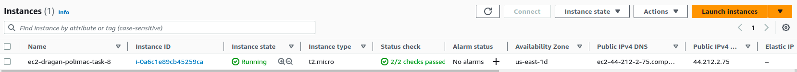
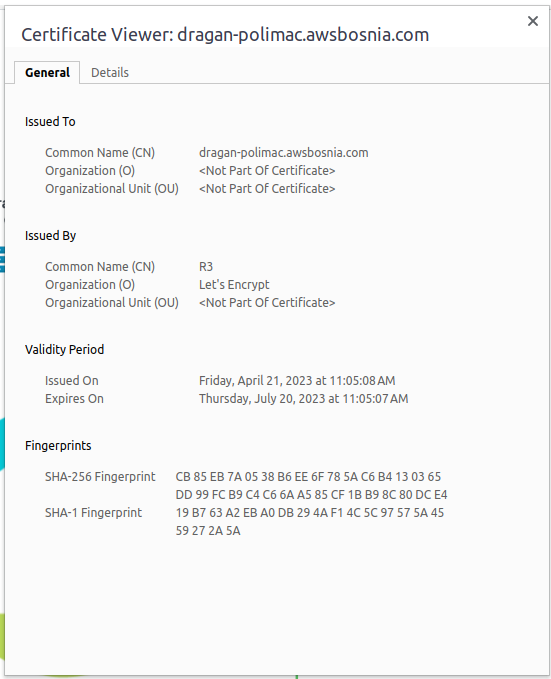
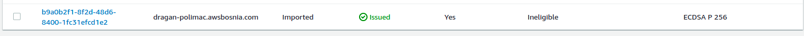
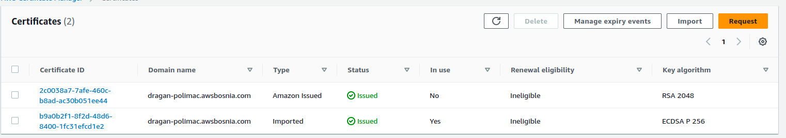
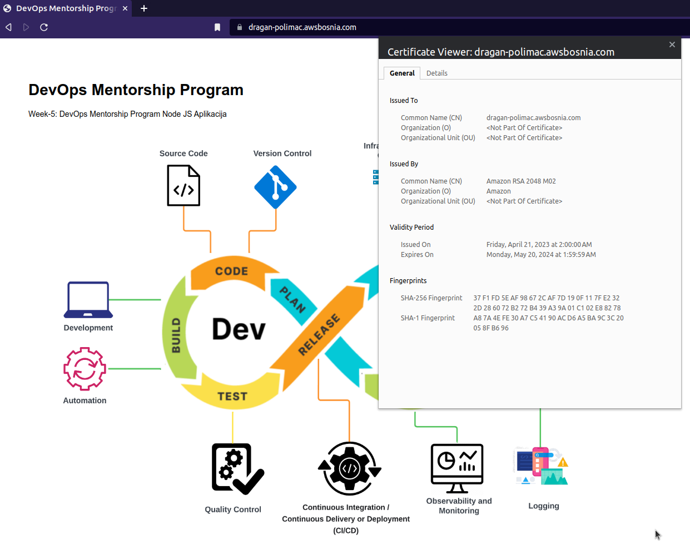

### TASK no. 8

🌐 TASK-8: Implement SSL Let's Encrypt, migrate to AWS SSM 🌐

- Task obuhvata:
    - [x] Od AMI image ec2-dragan-polimac-web-server kreirana nova EC2 instanca **ec2-dragan-polimac-task-8**.
    
    - [x] Kreiran je aws cli profil aws-bosnia
        ```bash
        $ cat ~/.aws/credentials
        ...
        [aws-bosnia]
        aws_access_key_id = XXXXXXXXXXX
        aws_secret_access_key = XXXXXXXXX
        ...
        $ cat ~/.aws/config
        ...
        [profile aws-bosnia]
        output = json
        ...
        ```
    - [x] Kreiran DNS record dragan-polimac.awsbosnia.com za Hosted Zone awsbosnia.com (Hosted zone ID: Z3LHP8UIUC8CDK)
      ```bash
      $ cat alias-resource.json
      {
        "Comment": "Creating Alias resource record sets in Route 53",
        "Changes": [
            {
                "Action": "CREATE",
                "ResourceRecordSet": {
                    "Name": "dragan-polimac.awsbosnia.com",
                    "Type": "CNAME",
                    "TTL": 60,
                    "ResourceRecords":[
                        {
                            "Value": "alb-dragan-polimac-web-server-1251414415.us-east-1.elb.amazonaws.com"
                        }
                    ]
            }
        }
        ]
      }
      # AWS CLI 
      $ aws route53 --profile aws-bosnia change-resource-record-sets --hosted-zone-id Z3LHP8UIUC8CDK --change-batch file://alias-resource.json
      ```
    - [x] Na EC2 instanci ec2-dragan-prezime-task-8 kreiran Let's Encrypt SSL certifikat. Nodejs aplikaciji omogućen pristup pristupiti preko linka https://dragan.polimac.awsbosnia.com.
    
    - [x] Omoguciti autorenewal SSL certifikata
    ```bash
    [root@ip-172-31-90-139 ~]# cat /etc/systemd/system/letsencrypt.service
    [Unit]
    Description=Certbot Renewal

    [Service]
    ExecStart=/usr/bin/certbot renew --post-hook "systemctl reload nginx"
    [root@ip-172-31-90-139 ~]# cat /etc/systemd/system/letsencrypt.timer
    [Unit]
    Description=Timer for Certbot Renewal

    [Timer]
    OnBootSec=300
    OnUnitActiveSec=6h

    [Install]
    WantedBy=multi-user.target
    [root@ip-172-31-90-139 ~]# systemctl daemon-reload
    [root@ip-172-31-90-139 ~]# systemctl enable --now letsencrypt.timer
    [root@ip-172-31-90-139 ~]# systemctl status letsencrypt.timer
    ● letsencrypt.timer - Timer for Certbot Renewal
         Loaded: loaded (/etc/systemd/system/letsencrypt.timer; enabled; preset: disabled)
         Active: active (waiting) since Fri 2023-04-21 12:00:02 UTC; 1 day ago
          Until: Fri 2023-04-21 12:00:02 UTC; 1 day ago
        Trigger: Sat 2023-04-22 18:03:32 UTC; 5h 33min left
       Triggers: ● letsencrypt.service

    Apr 21 12:00:02 ip-172-31-90-139.ec2.internal systemd[1]: Started letsencrypt.timer - Timer for Certbot Renewal.
    [root@ip-172-31-90-139 ~]# journalctl -u letsencrypt.service
    [root@ip-172-31-90-139 ~]# journalctl -u letsencrypt.service
    Apr 21 11:56:41 ip-172-31-90-139.ec2.internal systemd[1]: Started letsencrypt.service - Certbot Renewal.
    Apr 21 11:56:41 ip-172-31-90-139.ec2.internal certbot[9242]: Saving debug log to /var/log/letsencrypt/letsencrypt.log
    Apr 21 11:56:41 ip-172-31-90-139.ec2.internal certbot[9242]: - - - - - - - - - - - - - - - - - - - - - - - - - - - - - - - - - - - - - - - -
    Apr 21 11:56:41 ip-172-31-90-139.ec2.internal certbot[9242]: Processing /etc/letsencrypt/renewal/dragan-polimac.awsbosnia.com.conf
    Apr 21 11:56:41 ip-172-31-90-139.ec2.internal certbot[9242]: - - - - - - - - - - - - - - - - - - - - - - - - - - - - - - - - - - - - - - - -
    Apr 21 11:56:42 ip-172-31-90-139.ec2.internal certbot[9242]: Certificate not yet due for renewal
    Apr 21 11:56:42 ip-172-31-90-139.ec2.internal certbot[9242]: - - - - - - - - - - - - - - - - - - - - - - - - - - - - - - - - - - - - - - - -
    Apr 21 11:56:42 ip-172-31-90-139.ec2.internal certbot[9242]: The following certificates are not due for renewal yet:
    Apr 21 11:56:42 ip-172-31-90-139.ec2.internal certbot[9242]:   /etc/letsencrypt/live/dragan-polimac.awsbosnia.com/fullchain.pem expires on 2023-07-20 (skipped)
    Apr 21 11:56:42 ip-172-31-90-139.ec2.internal certbot[9242]: No renewals were attempted.
    Apr 21 11:56:42 ip-172-31-90-139.ec2.internal certbot[9242]: No hooks were run.
    Apr 21 11:56:42 ip-172-31-90-139.ec2.internal certbot[9242]: - - - - - - - - - - - - - - - - - - - - - - - - - - - - - - - - - - - - - - - -
    Apr 21 11:56:42 ip-172-31-90-139.ec2.internal systemd[1]: letsencrypt.service: Deactivated successfully.
    Apr 21 12:00:02 ip-172-31-90-139.ec2.internal systemd[1]: Started letsencrypt.service - Certbot Renewal.
    Apr 21 12:00:03 ip-172-31-90-139.ec2.internal certbot[9368]: Saving debug log to /var/log/letsencrypt/letsencrypt.log
    Apr 21 12:00:03 ip-172-31-90-139.ec2.internal certbot[9368]: - - - - - - - - - - - - - - - - - - - - - - - - - - - - - - - - - - - - - - - -
    Apr 21 12:00:03 ip-172-31-90-139.ec2.internal certbot[9368]: Processing /etc/letsencrypt/renewal/dragan-polimac.awsbosnia.com.conf
    Apr 21 12:00:03 ip-172-31-90-139.ec2.internal certbot[9368]: - - - - - - - - - - - - - - - - - - - - - - - - - - - - - - - - - - - - - - - -
    Apr 21 12:00:03 ip-172-31-90-139.ec2.internal certbot[9368]: Certificate not yet due for renewal
    Apr 21 12:00:03 ip-172-31-90-139.ec2.internal certbot[9368]: - - - - - - - - - - - - - - - - - - - - - - - - - - - - - - - - - - - - - - - -
    Apr 21 12:00:03 ip-172-31-90-139.ec2.internal certbot[9368]: The following certificates are not due for renewal yet:
    Apr 21 12:00:03 ip-172-31-90-139.ec2.internal certbot[9368]:   /etc/letsencrypt/live/dragan-polimac.awsbosnia.com/fullchain.pem expires on 2023-07-20 (skipped)
    Apr 21 12:00:03 ip-172-31-90-139.ec2.internal certbot[9368]: No renewals were attempted.
    Apr 21 12:00:03 ip-172-31-90-139.ec2.internal certbot[9368]: No hooks were run.
    Apr 21 12:00:03 ip-172-31-90-139.ec2.internal certbot[9368]: - - - - - - - - - - - - - - - - - - - - - - - - - - - - - - - - - - - - - - - -
    Apr 21 12:00:03 ip-172-31-90-139.ec2.internal systemd[1]: letsencrypt.service: Deactivated successfully.
    Apr 21 18:00:21 ip-172-31-90-139.ec2.internal systemd[1]: Started letsencrypt.service - Certbot Renewal.
    Apr 21 18:00:22 ip-172-31-90-139.ec2.internal certbot[20264]: Saving debug log to /var/log/letsencrypt/letsencrypt.log
    Apr 21 18:00:22 ip-172-31-90-139.ec2.internal certbot[20264]: - - - - - - - - - - - - - - - - - - - - - - - - - - - - - - - - - - - - - - - -
    Apr 21 18:00:22 ip-172-31-90-139.ec2.internal certbot[20264]: Processing /etc/letsencrypt/renewal/dragan-polimac.awsbosnia.com.conf
    Apr 21 18:00:22 ip-172-31-90-139.ec2.internal certbot[20264]: - - - - - - - - - - - - - - - - - - - - - - - - - - - - - - - - - - - - - - - -
    Apr 21 18:00:22 ip-172-31-90-139.ec2.internal certbot[20264]: Certificate not yet due for renewal
    Apr 21 18:00:22 ip-172-31-90-139.ec2.internal certbot[20264]: - - - - - - - - - - - - - - - - - - - - - - - - - - - - - - - - - - - - - - - -
    Apr 21 18:00:22 ip-172-31-90-139.ec2.internal certbot[20264]: The following certificates are not due for renewal yet:
    Apr 21 18:00:22 ip-172-31-90-139.ec2.internal certbot[20264]:   /etc/letsencrypt/live/dragan-polimac.awsbosnia.com/fullchain.pem expires on 2023-07-20 (skipped)
    Apr 21 18:00:22 ip-172-31-90-139.ec2.internal certbot[20264]: No renewals were attempted.
    Apr 21 18:00:22 ip-172-31-90-139.ec2.internal certbot[20264]: No hooks were run.
    Apr 21 18:00:22 ip-172-31-90-139.ec2.internal certbot[20264]: - - - - - - - - - - - - - - - - - - - - - - - - - - - - - - - - - - - - - - - -
    Apr 21 18:00:22 ip-172-31-90-139.ec2.internal systemd[1]: letsencrypt.service: Deactivated successfully.
    ```
    - [x] Koristeci openssl komande prikazan koji SSL certitikat se koristite i datum njegovog isteka
    ```bash
    [root@ip-172-31-90-139 ~]# curl -vIk https://dragan-polimac.awsbosnia.com
    *   Trying 34.236.207.133:443...
    * Connected to dragan-polimac.awsbosnia.com (34.236.207.133) port 443 (#0)
    * ALPN: offers h2,http/1.1
    * TLSv1.3 (OUT), TLS handshake, Client hello (1):
    * TLSv1.3 (IN), TLS handshake, Server hello (2):
    * TLSv1.3 (IN), TLS handshake, Encrypted Extensions (8):
    * TLSv1.3 (IN), TLS handshake, Certificate (11):
    * TLSv1.3 (IN), TLS handshake, CERT verify (15):
    * TLSv1.3 (IN), TLS handshake, Finished (20):
    * TLSv1.3 (OUT), TLS change cipher, Change cipher spec (1):
    * TLSv1.3 (OUT), TLS handshake, Finished (20):
    * SSL connection using TLSv1.3 / TLS_AES_128_GCM_SHA256
    * ALPN: server accepted h2
    * Server certificate:
    *  subject: CN=dragan-polimac.awsbosnia.com
    *  start date: Apr 21 09:05:08 2023 GMT
    *  expire date: Jul 20 09:05:07 2023 GMT
    *  issuer: C=US; O=Let's Encrypt; CN=R3
    *  SSL certificate verify result: unable to get local issuer certificate (20), continuing anyway.
    * using HTTP/2
    * h2h3 [:method: HEAD]
    * h2h3 [:path: /]
    * h2h3 [:scheme: https]
    * h2h3 [:authority: dragan-polimac.awsbosnia.com]
    * h2h3 [user-agent: curl/7.88.1]
    * h2h3 [accept: */*]
    * Using Stream ID: 1 (easy handle 0x56457be489a0)
    > HEAD / HTTP/2
    > Host: dragan-polimac.awsbosnia.com
    > user-agent: curl/7.88.1
    > accept: */*
    > 
    * TLSv1.3 (IN), TLS handshake, Newsession Ticket (4):
    < HTTP/2 200 
    HTTP/2 200 
    < date: Sun, 23 Apr 2023 12:37:18 GMT
    date: Sun, 23 Apr 2023 12:37:18 GMT
    < content-type: text/html; charset=utf-8
    content-type: text/html; charset=utf-8
    < content-length: 335
    content-length: 335
    < server: nginx/1.22.1
    server: nginx/1.22.1
    < x-powered-by: Express
    x-powered-by: Express
    < etag: W/"14f-2WhH8UHmjzRxVqhpDPoccXE0u8I"
    etag: W/"14f-2WhH8UHmjzRxVqhpDPoccXE0u8I"

    [root@ip-172-31-90-139 ~]# openssl s_client -showcerts -servername dragan-polimac.awsbosnia.com -connect dragan-polimac.awsbosnia.com:443 | openssl x509 -noout -dates
    depth=2 C = US, O = Internet Security Research Group, CN = ISRG Root X1
    verify return:1
    depth=1 C = US, O = Let's Encrypt, CN = R3
    verify return:1
    depth=0 CN = dragan-polimac.awsbosnia.com
    verify return:1
    notBefore=Apr 21 09:05:08 2023 GMT
    notAfter=Jul 20 09:05:07 2023 GMT

    [root@ip-172-31-90-139 ~]# openssl s_client --connect dragan-polimac.awsbosnia.com:443 | sed --quiet '/-BEGIN CERTIFICATE-/,/-END CERTIFICATE-/p' | openssl x509 -text -noout | grep -A2 Validity
    depth=2 C = US, O = Internet Security Research Group, CN = ISRG Root X1
    verify return:1
    depth=1 C = US, O = Let's Encrypt, CN = R3
    verify return:1
    depth=0 CN = dragan-polimac.awsbosnia.com
    verify return:1
    DONE
            Validity
                Not Before: Apr 21 09:05:08 2023 GMT
                Not After : Jul 20 09:05:07 2023 GMT
    ```
    - [X] Importovan Lets Encrypt SSL certifikat unutar AWS Certified Managera.
    
    - [X] Kreiran Load Balancer. Na nivou Load Balancera koristi se importovani SSL sertifikat. Nije kreiran ASG
    - [X] Ispis openssl komande koja prikazuje koji se SSL certitikat koristi za domenu i datum njegovog isteka.
    ```bash
    [root@ip-172-31-90-139 ~]# echo | openssl s_client --connect dragan-polimac.awsbosnia.com:443 | sed --quiet '/-BEGIN CERTIFICATE-/,/-END CERTIFICATE-/p' | certtool -i
    depth=2 C = US, O = Internet Security Research Group, CN = ISRG Root X1
    verify return:1
    depth=1 C = US, O = Let's Encrypt, CN = R3
    verify return:1
    depth=0 CN = dragan-polimac.awsbosnia.com
    verify return:1
    DONE
    X.509 Certificate Information:
    	Version: 3
    	Serial Number (hex): 03b14d069f2dd94c37adaeeb9a64f6f2a295
    	Issuer: CN=R3,O=Let's Encrypt,C=US
    	Validity:
    		Not Before: Fri Apr 21 09:05:08 UTC 2023
    		Not After: Thu Jul 20 09:05:07 UTC 2023
    	Subject: CN=dragan-polimac.awsbosnia.com
    	Subject Public Key Algorithm: EC/ECDSA
    	Algorithm Security Level: High (256 bits)
    		Curve:	SECP256R1
    		X:
    			37:df:64:ad:3e:d0:1c:75:35:09:c4:51:34:31:fd:7e
    			6e:17:6a:0b:01:31:c0:24:7b:70:5a:92:af:3c:52:d3
    		Y:
    			00:aa:61:3d:1d:9d:b8:9b:f9:2f:59:44:f8:60:76:3a
    			92:62:33:87:cb:1d:3d:a1:23:31:a2:5f:67:26:f7:11
    			2f
    	Extensions:
    		Key Usage (critical):
    			Digital signature.
    		Key Purpose (not critical):
    			TLS WWW Server.
    			TLS WWW Client.
    		Basic Constraints (critical):
    			Certificate Authority (CA): FALSE
    		Subject Key Identifier (not critical):
    			a75b26437bf98f7c6ddbb9790f0cf4b50f19df2f
    		Authority Key Identifier (not critical):
    			142eb317b75856cbae500940e61faf9d8b14c2c6
    		Authority Information Access (not critical):
    			Access Method: 1.3.6.1.5.5.7.48.1 (id-ad-ocsp)
    			Access Location URI: http://r3.o.lencr.org
    			Access Method: 1.3.6.1.5.5.7.48.2 (id-ad-caIssuers)
    			Access Location URI: http://r3.i.lencr.org/
    		Subject Alternative Name (not critical):
    			DNSname: dragan-polimac.awsbosnia.com
    		Certificate Policies (not critical):
    			2.23.140.1.2.1 (CA/B Domain Validated)
    			1.3.6.1.4.1.44947.1.1.1
    				URI: http://cps.letsencrypt.org
    		CT Precertificate SCTs (not critical):
    			Signed Certificate Timestamp 1:
    				Version: 1
    				Log ID: b73efb24df9c4dba75f239c5ba58f46c5dfc42cf7a9f35c49e1d098125edb499
    				Time: Fri, Apr 21 10:05:08 UTC 2023
    				Extensions: none
    				Signature algorithm: ECDSA-SHA256
    				Signature: 3046022100e29bb2391faaf103e72ae4272814f2291096869cc8cb55e2a31a1487f3b09220022100b130414d8791545781c8c4dcfbd28f1bbf027d82a736b402fe27ffb53c6b997c
    			Signed Certificate Timestamp 2:
    				Version: 1
    				Log ID: 7a328c54d8b72db620ea38e0521ee98416703213854d3bd22bc13a57a352eb52
    				Time: Fri, Apr 21 10:05:08 UTC 2023
    				Extensions: none
    				Signature algorithm: ECDSA-SHA256
    				Signature: 304502204778870bac55b3cddad0973e1b4f91ae3b623f8514d812abbccb3eb2fc8ca5a80221009a14289987d0b70d226e05a70c8d2723e10a89f596894bc31697c14dd080af7a
    	Signature Algorithm: RSA-SHA256
    	Signature:
    		a4:97:d2:4d:d3:0d:72:c7:3a:7d:19:f9:62:0b:da:af
    		66:96:1e:8c:04:7e:f3:d5:a7:52:6e:74:c7:7e:44:00
    		ef:37:c5:ea:cc:4b:fd:11:12:13:f9:9c:5d:18:cf:15
    		69:dd:1b:c0:b1:9f:fb:14:36:fa:16:4d:49:13:58:f1
    		8a:65:8a:78:b8:56:a2:92:2e:d3:25:62:4e:e3:b9:75
    		dc:6a:63:94:9c:24:9b:c3:ba:cf:20:1e:c8:5c:f2:b6
    		de:be:d0:ea:8f:60:c6:b4:4e:8b:f6:88:26:f5:7f:93
    		5f:42:55:9c:f8:8a:0d:bc:1f:03:5c:e8:0b:50:f4:01
    		1f:e2:e6:e6:19:a8:f7:1a:14:7b:c3:a8:50:f3:e0:2c
    		73:71:f4:9c:0a:39:51:53:00:8c:02:da:91:fd:7a:87
    		a1:8c:8b:38:e8:1a:ab:1b:29:c3:60:ac:fc:c4:53:ba
    		fc:e1:19:61:c5:7a:91:06:fa:65:d3:3d:ef:68:34:de
    		9c:c2:f0:c4:9d:fe:20:ec:16:e8:72:0c:39:c4:be:e7
    		89:97:dd:f6:2c:df:31:da:54:ec:6c:04:18:b8:15:36
    		55:a5:b4:8c:9a:49:6f:9a:f8:e3:f9:72:4f:6b:24:a7
    		42:65:ea:88:0d:10:66:c0:85:65:01:b0:d1:06:ab:33
    Other Information:
    	Fingerprint:
    		sha1:19b763a2eba0db294af14c5c97575a4559272a5a
    		sha256:cb85eb7a0538b6ee6f785ac6b4130365dd99fcb9c4c66aa585cf1bb98c80dce4
    	Public Key ID:
    		sha1:373acc08c073efcf7bb3b6fc28f9d4183e294684
    		sha256:b7e76a82b673b241757207189dafa3b3bfd7daf657923123bbe7c883c2e9acd0
    	Public Key PIN:
    		pin-sha256:t+dqgrZzskF1cgcYna+js7/X2vZXkjEju+fIg8LprNA=

    -----BEGIN CERTIFICATE-----
    MIIEdDCCA1ygAwIBAgISA7FNBp8t2Uw3ra7rmmT28qKVMA0GCSqGSIb3DQEBCwUA
    MDIxCzAJBgNVBAYTAlVTMRYwFAYDVQQKEw1MZXQncyBFbmNyeXB0MQswCQYDVQQD
    EwJSMzAeFw0yMzA0MjEwOTA1MDhaFw0yMzA3MjAwOTA1MDdaMCcxJTAjBgNVBAMT
    HGRyYWdhbi1wb2xpbWFjLmF3c2Jvc25pYS5jb20wWTATBgcqhkjOPQIBBggqhkjO
    PQMBBwNCAAQ332StPtAcdTUJxFE0Mf1+bhdqCwExwCR7cFqSrzxS06phPR2duJv5
    L1lE+GB2OpJiM4fLHT2hIzGiX2cm9xEvo4ICWDCCAlQwDgYDVR0PAQH/BAQDAgeA
    MB0GA1UdJQQWMBQGCCsGAQUFBwMBBggrBgEFBQcDAjAMBgNVHRMBAf8EAjAAMB0G
    A1UdDgQWBBSnWyZDe/mPfG3buXkPDPS1DxnfLzAfBgNVHSMEGDAWgBQULrMXt1hW
    y65QCUDmH6+dixTCxjBVBggrBgEFBQcBAQRJMEcwIQYIKwYBBQUHMAGGFWh0dHA6
    Ly9yMy5vLmxlbmNyLm9yZzAiBggrBgEFBQcwAoYWaHR0cDovL3IzLmkubGVuY3Iu
    b3JnLzAnBgNVHREEIDAeghxkcmFnYW4tcG9saW1hYy5hd3Nib3NuaWEuY29tMEwG
    A1UdIARFMEMwCAYGZ4EMAQIBMDcGCysGAQQBgt8TAQEBMCgwJgYIKwYBBQUHAgEW
    Gmh0dHA6Ly9jcHMubGV0c2VuY3J5cHQub3JnMIIBBQYKKwYBBAHWeQIEAgSB9gSB
    8wDxAHcAtz77JN+cTbp18jnFulj0bF38Qs96nzXEnh0JgSXttJkAAAGHo0ZW+wAA
    BAMASDBGAiEA4puyOR+q8QPnKuQnKBTyKRCWhpzIy1XioxoUh/OwkiACIQCxMEFN
    h5FUV4HIxNz70o8bvwJ9gqc2tAL+J/+1PGuZfAB2AHoyjFTYty22IOo44FIe6YQW
    cDIThU070ivBOlejUutSAAABh6NGVwkAAAQDAEcwRQIgR3iHC6xVs83a0Jc+G0+R
    rjtiP4UU2BKrvMs+svyMpagCIQCaFCiZh9C3DSJuBacMjScj4QqJ9ZaJS8MWl8FN
    0ICvejANBgkqhkiG9w0BAQsFAAOCAQEApJfSTdMNcsc6fRn5Ygvar2aWHowEfvPV
    p1JudMd+RADvN8XqzEv9ERIT+ZxdGM8Vad0bwLGf+xQ2+hZNSRNY8Yplini4VqKS
    LtMlYk7juXXcamOUnCSbw7rPIB7IXPK23r7Q6o9gxrROi/aIJvV/k19CVZz4ig28
    HwNc6AtQ9AEf4ubmGaj3GhR7w6hQ8+Asc3H0nAo5UVMAjALakf16h6GMizjoGqsb
    KcNgrPzEU7r84RlhxXqRBvpl0z3vaDTenMLwxJ3+IOwW6HIMOcS+54mX3fYs3zHa
    VOxsBBi4FTZVpbSMmklvmvjj+XJPaySnQmXqiA0QZsCFZQGw0QarMw==
    -----END CERTIFICATE-----
    [root@ip-172-31-90-139 ~]# echo | openssl s_client --connect dragan-polimac.awsbosnia.com:443 | sed --quiet '/-BEGIN CERTIFICATE-/,/-END CERTIFICATE-/p' | certtool -i | grep -A2 Validity
    depth=2 C = US, O = Internet Security Research Group, CN = ISRG Root X1
    verify return:1
    depth=1 C = US, O = Let's Encrypt, CN = R3
    verify return:1
    depth=0 CN = dragan-polimac.awsbosnia.com
    verify return:1
    DONE
    	Validity:
    		Not Before: Fri Apr 21 09:05:08 UTC 2023
    		Not After: Thu Jul 20 09:05:07 UTC 2023

    ```
    - [X] Kreiran novi SSL certifikat unutar AWS Certified Managera, azuriran ALB da koristi novi SSL. Dat i ispis za DNS Challenge.
    ```bash
    aws route53 --profile aws-bosnia list-resource-record-sets --hosted-zone-id Z3LHP8UIUC8CDK  | jq -r '.ResourceRecordSets[] | select(.Name | contains("dragan-polimac")) '
    {
      "Name": "dragan-polimac.awsbosnia.com.",
      "Type": "CNAME",
      "TTL": 60,
      "ResourceRecords": [
        {
          "Value": "alb-dragan-polimac-web-server-1251414415.us-east-1.elb.amazonaws.com"
        }
      ]
    }
    {
      "Name": "_aabb6bda79090d429e55687ae2513f7b.dragan-polimac.awsbosnia.com.",
      "Type": "CNAME",
      "TTL": 60,
      "ResourceRecords": [
        {
          "Value": "_1663d7361680cd742dd763d33dafbede.fgsdscwdjl.acm-validations.aws."
        }
      ]
    }
    ```
    
    - [X] Koristeci openssl komande prikazan koji se SSL sertitikat koristi za domenu i datum njegovog isteka.
    ```bash
    [root@ip-172-31-90-139 ~]# echo | openssl s_client --connect dragan-polimac.awsbosnia.com:443 | sed --quiet '/-BEGIN CERTIFICATE-/,/-END CERTIFICATE-/p' | openssl x509 -text -noout | grep -A2 Validity
    depth=2 C = US, O = Amazon, CN = Amazon Root CA 1
    verify return:1
    depth=1 C = US, O = Amazon, CN = Amazon RSA 2048 M02
    verify return:1
    depth=0 CN = dragan-polimac.awsbosnia.com
    verify return:1
    DONE
            Validity
                Not Before: Apr 21 00:00:00 2023 GMT
                Not After : May 19 23:59:59 2024 GMT
    ```
    
    - [X] Kreiran AMI image pod nazivom ami-ec2-dragan-polimac-task-8 i terminirani resursi.